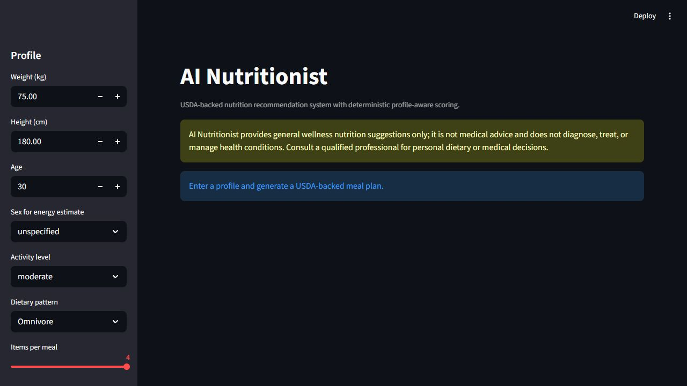
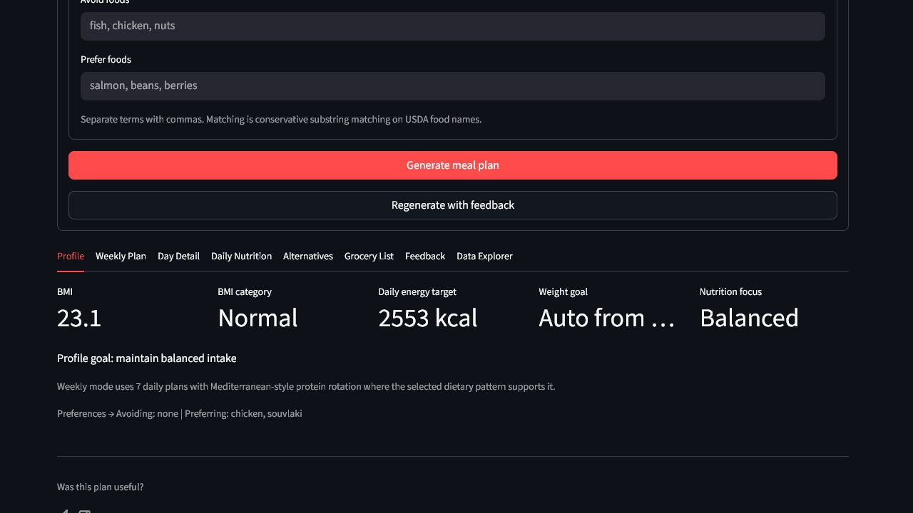

# AI Nutritionist

AI Nutritionist is a local-first nutrition recommendation system that builds profile-aware daily and weekly meal plans from USDA FoodData Central / FNDDS data plus a curated Mediterranean/Greek food extension. The current version uses an expanded processed catalog, conservative dietary filters, a deterministic neural MLP food ranker, explicit weight-goal controls, and constraint-based meal assembly.

This is not a medical or clinical tool. It provides general wellness nutrition suggestions only and should not be used to diagnose, treat, or manage any health condition.

## Project Status

The public version is a standalone software system, not a thesis, dissertation, or academic submission. It evolved from an earlier recommender prototype into a portfolio-ready application with a reproducible data pipeline, neural ranking, CLI, Streamlit UI, tests, and evaluation notes.

## What It Does

- Calculates BMI and a coarse BMI category from height and weight.
- Estimates daily energy, protein, fiber, sodium, saturated-fat, and sugar guardrails from profile inputs.
- Separates weight goal (`auto`, maintain, lose, gain) from nutrition focus (`balanced`, higher protein, higher fiber, lighter meals, lower sodium).
- Uses a bounded calorie deficit for explicit weight-loss plans and scales portions when a generated plan sits too far above the target.
- Optionally uses body-fat percentage to estimate lean body mass and raise protein targets.
- Builds an expanded processed USDA/FNDDS food catalog with meal tags, serving sizes, vegetarian flags, vegan flags, and processing signals.
- Adds a curated Mediterranean/Greek extension with practical foods such as Greek yogurt bowls, dakos-style toast, lentil soup, fasolada, chickpea salads, grilled fish, horta, Greek salads, and olive-oil vegetable sides.
- Trains a deterministic `MLPRegressor` ranker on weak-supervised nutrition-quality labels derived from USDA nutrients and public-health guidance.
- Combines neural ranking with hard meal guardrails for calories, sodium, saturated fat, sugars, and food-family repetition.
- Supports nutrition focus modes: balanced, higher protein, higher fiber, lighter meals, and lower sodium.
- Supports avoid/prefer terms so users can steer recommendations without making medical claims.
- Supports Mediterranean/Greek, omnivore, vegetarian, vegan, and keto-style / low-carb dietary patterns.
- Builds a 7-day plan option with Mediterranean-style rotation across poultry, fish/seafood, legumes, vegetables, whole grains/starches, and olive-oil sides.
- Produces meal titles, item-level nutrient totals, macro percentages, daily progress, swap alternatives, local thumbs feedback, and plain-language explanations.
- Stores feedback only in the current Streamlit session by default; it can be exported as CSV, but it is not uploaded by the app.

## Screenshots

Screenshots live under `docs/screenshots/` and are kept in the repository so reviewers can understand the app before running Streamlit locally.

| Profile setup | Generated recommendations |
| --- | --- |
|  |  |

Recommended capture flow:

```bash
streamlit run app.py
```

Open the local Streamlit URL, generate recommendations, and save screenshots as:

- `docs/screenshots/streamlit-home.png`
- `docs/screenshots/streamlit-recommendations.png`

## Setup

```bash
python -m venv .venv
.venv\Scripts\activate
python -m pip install --upgrade pip
python -m pip install -r requirements.txt
```

## Streamlit Usage

```bash
streamlit run app.py
```

The Streamlit app requires the user to press `Generate meal plan` before recommendations appear. After generation, users can leave thumbs feedback for the full plan or individual meals. Negative feedback is stored locally in `st.session_state` and can be used by `Regenerate with feedback` as a temporary avoid signal for the next plan.

## CLI Usage

```bash
python cli.py --weight 75 --height 180 --age 30 --sex male --activity moderate --dietary-pattern mediterranean --weight-goal maintain --top-k 4
```

Preference-aware example:

```bash
python cli.py --weight 75 --height 180 --age 30 --goal-focus lower_sodium --avoid "fish,chicken" --prefer "beans" --top-k 4
```

Weekly Mediterranean example:

```bash
python cli.py --weight 125 --height 200 --age 30 --sex male --activity moderate --dietary-pattern mediterranean --weight-goal lose --weekly --top-k 3
```

Vegan example:

```bash
python cli.py --weight 68 --height 172 --age 32 --sex female --activity moderate --dietary-pattern vegan --top-k 4
```

Keto-style example:

```bash
python cli.py --weight 75 --height 180 --age 30 --dietary-pattern keto_style --body-fat 18 --goal-focus higher_protein --top-k 4
```

Options:

- `--weight`: weight in kg
- `--height`: height in cm
- `--age`: age in years
- `--sex`: `female`, `male`, or `unspecified`
- `--activity`: `sedentary`, `light`, `moderate`, or `active`
- `--dietary-pattern`: `mediterranean`, `omnivore`, `vegetarian`, `vegan`, or `keto_style`
- `--weight-goal`: `auto`, `maintain`, `lose`, or `gain`
- `--body-fat`: optional body-fat percentage used for a lean-mass protein target
- `--goal-focus`: `balanced`, `higher_protein`, `higher_fiber`, `lighter_meals`, or `lower_sodium`
- `--avoid`: comma-separated food-name terms to exclude
- `--prefer`: comma-separated food-name terms to boost
- `--top-k` / `--topk`: number of foods per meal, minimum 3
- `--weekly`: build a weekly plan instead of one day
- `--days`: number of days for weekly mode, from 1 to 14

## Data

The committed base catalog at `data/foods_catalog.csv` is derived from USDA FoodData Central FNDDS 2021-2023 CSV data, release date October 2024. `data/mediterranean_foods.csv` adds a small curated Mediterranean/Greek extension with estimated nutrient values from USDA-style food components so the public app recommends recognizable meals rather than isolated high-scoring ingredients. The full USDA archive is not committed.

Rebuild the processed catalog and Hugging Face-compatible CSV export:

```bash
python scripts/build_food_catalog.py
```

Source: https://fdc.nal.usda.gov/download-datasets/

The vegan classifier is conservative: ambiguous mixed dishes are not marked vegan unless category and description rules make plant-only status clear enough for a public wellness recommender. Mediterranean/Greek mode is food-culture framing, not a medical diet prescription. Keto-style mode is a low-carbohydrate wellness filter, not a therapeutic ketogenic diet.

## Neural Ranking

The project does not claim clinical fine-tuning. Instead, it trains a lightweight neural ranker on weak labels generated from the local USDA catalog: nutrient density, meal fit, sodium, saturated fat, total sugars, processing signal, and BMI-aware energy direction. This gives the project a real trained model while staying honest about the absence of clinical outcome labels.

The weekly planner is deterministic orchestration around the same ranker and guardrails. It rotates preference boosts by day so Mediterranean mode can produce practical chicken, fish, legumes, vegetables, whole grains/starches, yogurt, and olive-oil side patterns rather than repeating one high-scoring day.

## Evaluation

The project includes an evaluation matrix across underweight, normal, overweight, severely overweight, older-adult, Mediterranean, vegetarian, vegan, and keto-style profiles.

```bash
python -m ai_nutritionist.evaluation
```

See [docs/EVALUATION.md](docs/EVALUATION.md) and [docs/RESEARCH.md](docs/RESEARCH.md).

## Tests

```bash
pytest -q
```

Coverage includes BMI/category logic, explicit weight goals, bounded weight-loss calorie targets, body-fat protein targets, macro totals, USDA catalog schema, Mediterranean extension loading, neural ranking reproducibility, vegan filtering, keto-style filtering, preference-aware ranking, recommendation shape, weekly Mediterranean rotation, local feedback UI contracts, alternatives, practical meal constraints, evaluation matrix behavior, and CLI smoke behavior.

## Limitations

- BMI is a simplified population-level indicator and is not a diagnosis.
- Energy targets are estimates based on profile assumptions, not clinical prescriptions.
- Weight-loss targets use a bounded deficit heuristic and portion scaling, but they do not guarantee weight change.
- Feedback is local product feedback, not a clinical outcome label or diagnosis signal.
- USDA nutrient rows and curated Mediterranean estimates are useful reference data but do not capture allergies, medication interactions, budget, cooking method, appetite, disease state, or clinician guidance.
- Total sugars are not the same as added sugars. The system treats sugar as a ranking and guardrail signal, not a medical rule.
- Vegan recommendations include plant-only filtering but do not solve B12, vitamin D, iron, iodine, omega-3, or calcium planning by themselves.
- Keto-style recommendations are not a therapeutic ketogenic diet and should not be used to manage diabetes, epilepsy, pregnancy nutrition, or medical conditions.
- The neural ranker is trained on weak labels, not clinical outcomes or registered-dietitian preference labels.

## Architecture

See [docs/ARCHITECTURE.md](docs/ARCHITECTURE.md).
